# triggerzone tutorial

For this tutorial, only the in-game editing of zones will be covered.  You are assumed to already know how to move files around and call exports from your own code.  
It is also assumed that you can install and start a resource without assistance.  There are no special considerations when installing and running `triggerzone`.

# Premise

The use case covered by this tutorial is a Mission resource where the player needs to deliver a vehicle to a specific location.  You have picked out this location in Rancho:

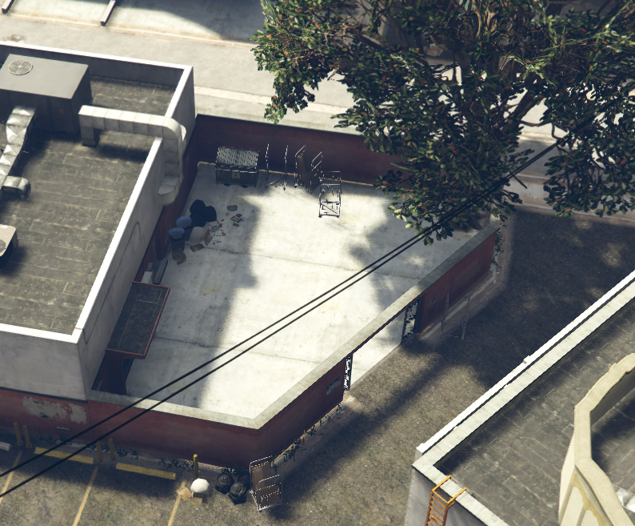

Clearly, this area is not square, and it's certainly not round, so setting up a square or circle to cover it would either *not* cover the whole courtyard, or it would also allow you to deliver a vehicle outside the gate. This is not ideal. We need a more complex polygon for detection.

# Creating a new zone

The first step is to create a new zone.  This is done by issuing the command `triggerzone new my_mission_delivery`

Naming things is very hard, but you should try your hardest to pick a name that is unlikely to conflict with names picked by other resources.  If we assume that your resource is named `my-mission`, and this is the delivery mission, then `my_mission_delivery` is a good name.  If anyone else picks a zone name that has your resource in it's name, that's on them!

The zone name can't have spaces or special characters in it. They'll get eaten!

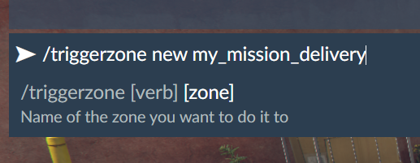

# The main Editor screen

For a full breakdown of the editor screen, see [the main documentation](../README.md#editor-ui), as it will not be covered here.

When starting a new zone, you will be in camera control mode, meaning you are controlling a free-floating camera.

If you are familiar with the usual freemode controls, you'll feel right at home here. If not, then you should check out [the editor hotkeys table](../README.md#editor-hotkeys). The short version:  WASD to move the camera, mouse to aim it, click to add vertecies, right-click to delete.

# Placing verticies

The verticies, or *edge points*, of your polygon are easy to move around after you add them. It is recommended that you first make a very rough outline of your zone, and then move the points into place.

When you click on the ground for the first time, it will set the altitude of your zone to where you click. It is important that this first click is *actually on the ground*, or you will have to edit this later.  It should look something like this:

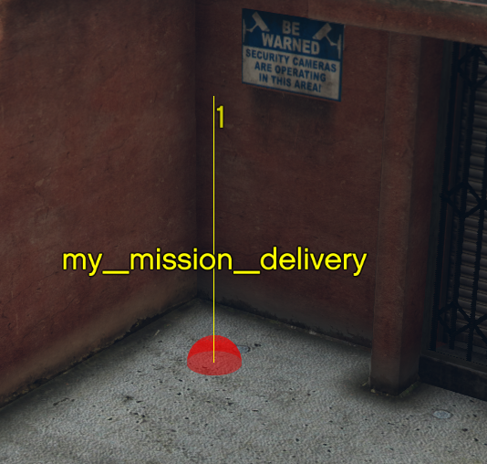

After adding the first one, you can rapidly go through the rough points, until you have something close to this:

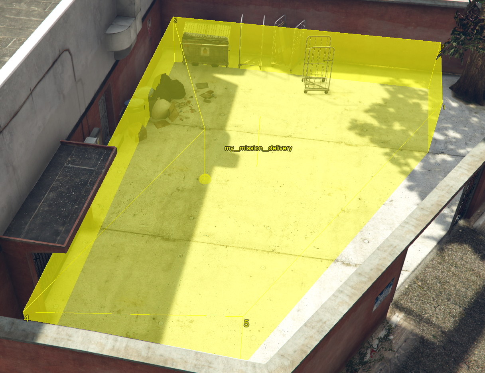

As you place points, the numbers will change around. This is normal, and expected, as it will rearrange your zone to always be in a counter-clockwise order.  Why this is done is outside the scope of this tutorial.

After you have the rough outline in place, you can move the points into their final position. To do this, move the cursor sphere close to the point you want to move, so it turns red. Hold the left mouse button, and move the mouse. The point will follow the cursor.

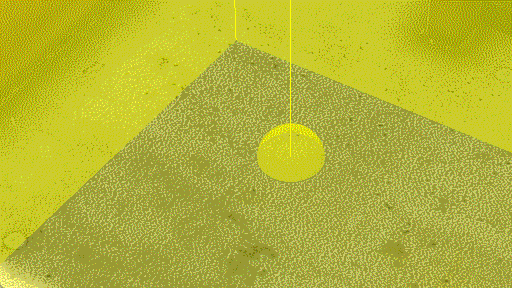

Note that the floor and ceiling of the zone will *not* update while moving. This is for performance reasons.

When all the points are in their proper place, it should look something like this:

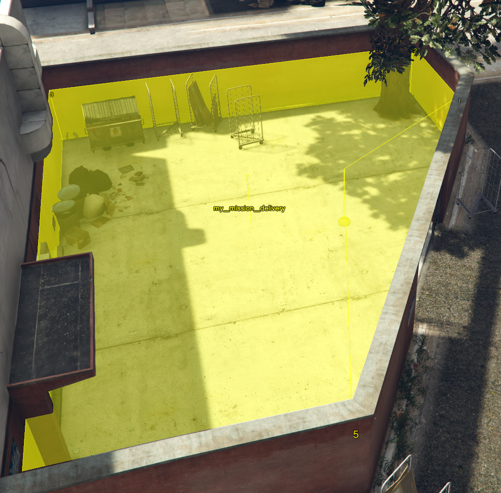

# Saving your work

Press space to switch from controlling the camera to interacting with the user interface.  This will let you change the label, and save your work.

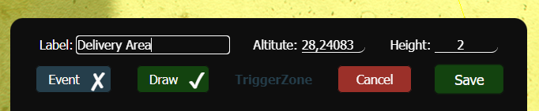

Clicking the Save button will save the zone to the server, and also deploy it to be visible for all other players on the server.

By default, the zone is drawn. This is useful for testing purposes, but is bad for performance. It is a development aid, not a display feature.

Anyway, now that your work is saved, you can cancel editing.  The red Cancel button looks dangerous, because it is. It will discard all changes since your last save. Right now, that's not a problem, since you just saved.

When you cancel, you will be dropped out of the editor, and sent back to your Player Ped.  Use it to go in and out of the zones, to make sure it triggers where you expect it to.

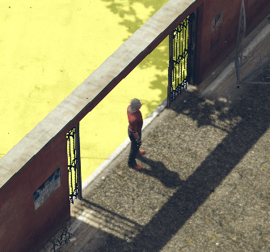 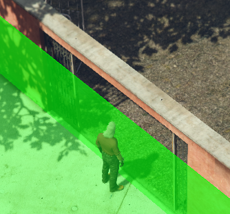

The default colors are yellow for being outside the zone, and green for being inside.

# Turn off zone drawing!

We're almost done, and just need to change one little detail:  Turn off drawing!

Drawing the zone is very useful for testing and development, but it's absolute murder on performance, especially if you have several zones.

To edit the zone again, issue the command `triggerzone edit my_mission_delivery`

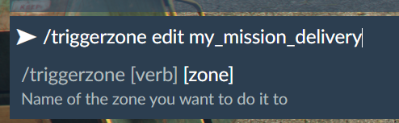

This will open the zone back up for editing, and you can then press space to switch from camera mode to UI mode, and uncheck the Draw option.

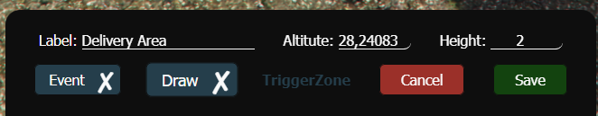

Don't forget to Save before you Cancel out of the editor.  The zone will be invisible, but it's still there. Your script can check if any given point, such as the coordinates of the vehicle you are delivering, is within the zone.

This can be done using [the exported functions](../README.md#exported-functions).

# All done!

That's it. You now have a zone file. It's stored in the `zones/` directory of the `triggerzone` resource. You should *probably* move the file from there to the `zones/` directory of *your own resource*, to be distributed with the rest of your files.

